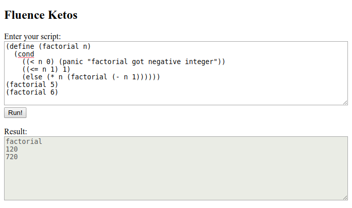

# Fluence Ketos

A [Fluence](https://fluence.network/) application that allows uploading and executing [Ketos](https://github.com/murarth/ketos) scripts

[Live App](http://ipfs.fluence.one:8080/ipfs/QmNPg17gXWsZVgMirJc6jJWfGzDAcjmFrytJFmtZrsTaYv/index.html)



## What is Fluence?
Fluence is an efficient trustless computation platform that allows to achieve few seconds request processing latency and cost efficiency similar to traditional cloud computing. To run computations, Fluence uses a WebAssembly virtual machine, which allows to deploy into the decentralized environment applications written in multiple programming languages.

## What is Ketos?
Ketos is a Lisp dialect functional programming language.
The primary goal of Ketos is to serve as a scripting and extension language for programs written in the Rust programming language.

## Compile

```bash
~$ cargo +nightly build --target wasm32-unknown-unknown --release
```
